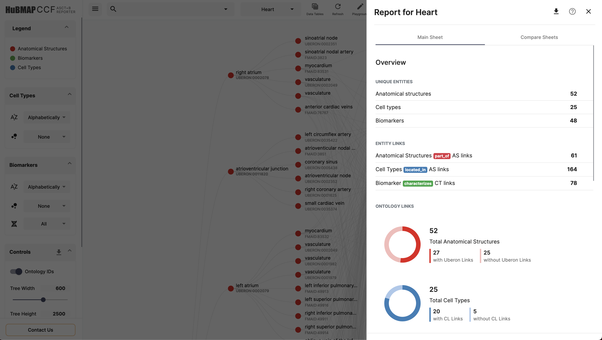
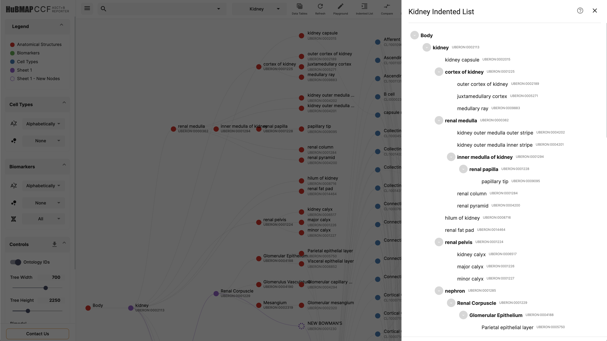
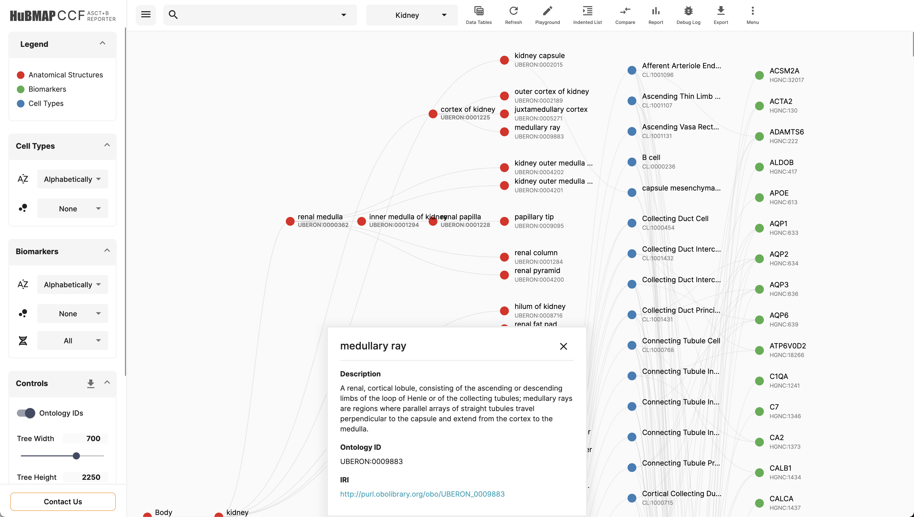
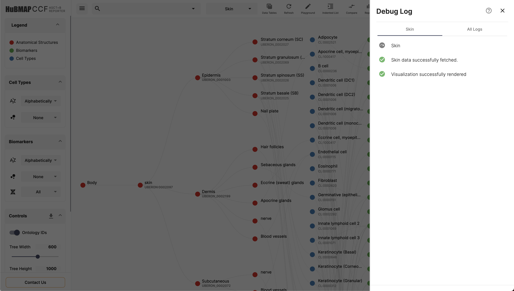

# HuBMAP CCF ASCT+B Reporter

The [CCF ASCT Reporter](https://hubmapconsortium.github.io/ccf-asct-reporter/) is a basic visualization tool for displaying the [flattened ASCT tables](https://docs.google.com/spreadsheets/u/1/d/1F7D0y7pNPVIR3W4LjjtIMGg7rKTOxwyjVKzS-iiffz4/edit#gid=2034682742) built using Angular 10.

[](https://github.com/hubmapconsortium/ccf-asct-reporter)
[](https://github.com/hubmapconsortium/ccf-asct-reporter/blob/master/LICENSE)


## Overview

The [CCF ASCT+B Reporter](https://hubmapconsortium.github.io/ccf-asct-reporter/) includes a partonomy tree that presents relationships between various anatomical structures and substructures, that is combined with their respective cell types and biomarkers via a bimodal network. The reporter also presents an indented list tree for a more traditional look. Along with visualizing, the reporter has a report generator that enlists various meta data for the visualized ASCT table, which is download-able. There is also an in-house debug logger that lists any issues related to the data provided in the table. The reporter is also accompanied by a backend server, ASCT+B API.

## Links

- Production Site: <https://hubmapconsortium.github.io/ccf-asct-reporter/> ([staging](https://ccf-asct-reporter.netlify.app))
- Documentation: <https://hubmapconsortium.github.io/ccf-asct-reporter/docs> ([staging](https://ccf-asct-reporter.netlify.app/docs))
- ASCT+B API: <https://apps.humanatlas.io/asctb-api/> ([staging](https://apps.humanatlas.io/asctb-api--staging/))
- Change Log: [CHANGELOG.md](CHANGELOG.md)

## Installation

```shell
$ git clone https://github.com/hubmapconsortium/ccf-asct-reporter
$ cd ccf-asct-reporter

# Reporter
$ npm install
$ ng serve
# linting
$ ng lint

# API
$ cd asctb-api
$ npm install
$ npm start # default port is 5000
# linting
$ npm run lint
$ npm run lint-fix
```

## Deployment

Deployment is accomplished via GitHub Actions based on the branch. The `main` branch deploys to production (both the web application and ASCT+B API server) and `develop` deploys to staging.

## Details

### Currently supported ASCT Tables

Below are a list of ASCT+B tables supported by the Reporter:

- [Bone Marrow & Blood](https://docs.google.com/spreadsheets/d/1F7D0y7pNPVIR3W4LjjtIMGg7rKTOxwyjVKzS-iiffz4/edit#gid=1852470103)
- [Brain](https://docs.google.com/spreadsheets/d/1F7D0y7pNPVIR3W4LjjtIMGg7rKTOxwyjVKzS-iiffz4/edit#gid=345174398)
- [Heart](https://docs.google.com/spreadsheets/d/1F7D0y7pNPVIR3W4LjjtIMGg7rKTOxwyjVKzS-iiffz4/edit#gid=1240281363)
- [Intestine, Large](https://docs.google.com/spreadsheets/d/1F7D0y7pNPVIR3W4LjjtIMGg7rKTOxwyjVKzS-iiffz4/edit#gid=1687995716)
- [Kidney](https://docs.google.com/spreadsheets/d/1F7D0y7pNPVIR3W4LjjtIMGg7rKTOxwyjVKzS-iiffz4/edit#gid=1760639962)
- [Lung](https://docs.google.com/spreadsheets/d/1F7D0y7pNPVIR3W4LjjtIMGg7rKTOxwyjVKzS-iiffz4/edit#gid=1824552484)
- [Lymph Nodes](https://docs.google.com/spreadsheets/d/1F7D0y7pNPVIR3W4LjjtIMGg7rKTOxwyjVKzS-iiffz4/edit#gid=272157091)
- [Skin](https://docs.google.com/spreadsheets/d/1F7D0y7pNPVIR3W4LjjtIMGg7rKTOxwyjVKzS-iiffz4/edit#gid=104836770)
- [Spleen](https://docs.google.com/spreadsheets/d/1F7D0y7pNPVIR3W4LjjtIMGg7rKTOxwyjVKzS-iiffz4/edit#gid=22580074)
- [Thymus](https://docs.google.com/spreadsheets/d/1F7D0y7pNPVIR3W4LjjtIMGg7rKTOxwyjVKzS-iiffz4/edit#gid=314238819)
- [Vasculature](https://docs.google.com/spreadsheets/d/1F7D0y7pNPVIR3W4LjjtIMGg7rKTOxwyjVKzS-iiffz4/edit#gid=1896956438)

### Features

- Visualization
- Compare
- Playground
- Indented List
- Report Generator
- Indented List
- Search
- Export
- Visualization Functions
- Visualization Controls

### Documentation

Click [here](https://ccf-asct-reporter.netlify.app/docs) to view the documentation.

### ASCT+B API

The reporter is also accompanied by a backend server ASCT+B API. In the event of Google Sheets blocking requests by the Reporter or any error, the Reporter fetches the data from the ASCT+B API which runs a simple Node script to fetch the data from Google Sheets. By supplying the SheetId and GID to the ASCT+B API, the data from the flattened tables can be retrieved. If for some reason the ASCT+B API also fails to retrieve the data, the Reporter falls to its system cache, which contains a snapshot of the flattened tables.

The Miner can also be used as a stand-alone tool to retrieve the data from the flattened Google sheets. Below is the API that you'll have to use,

```
https://asctb-api.herokuapp.com/asctb-reporter/<sheetID>/<gid>
```

This will either return the data, or will return a `500` HTTP code.

#### Deploying

Since the ASCT+B API is a dynamic script, Heroku has been used to deploy the server. Heroky is free to use for this usage. Deployment is accomplished via GitHub Actions based on the branch. The `main` branch deploys to production and `develop` deploys to staging.

## Screenshots of the ASCT+B Reporter

Visualization


Hovering over a node


Clicking on a node


Report



Indented List



Info Sheet



Debug Log



## Contributing

If you'd like to contribute, follow the steps below,

```shell
$ git clone https://github.com/hubmapconsortium/ccf-asct-reporter
$ cd ccf-asct-reporter
$ git checkout -b <new_branch_name>
```

Commit the changes to the new feature branch and make a pull request!

## License

[MIT](https://choosealicense.com/licenses/mit/)
