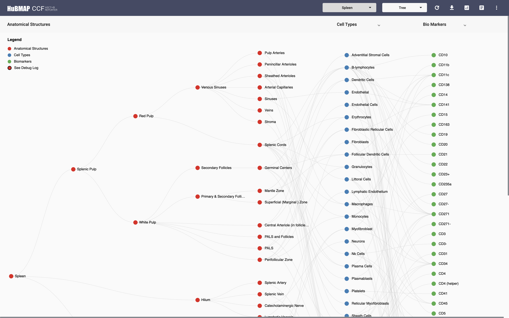
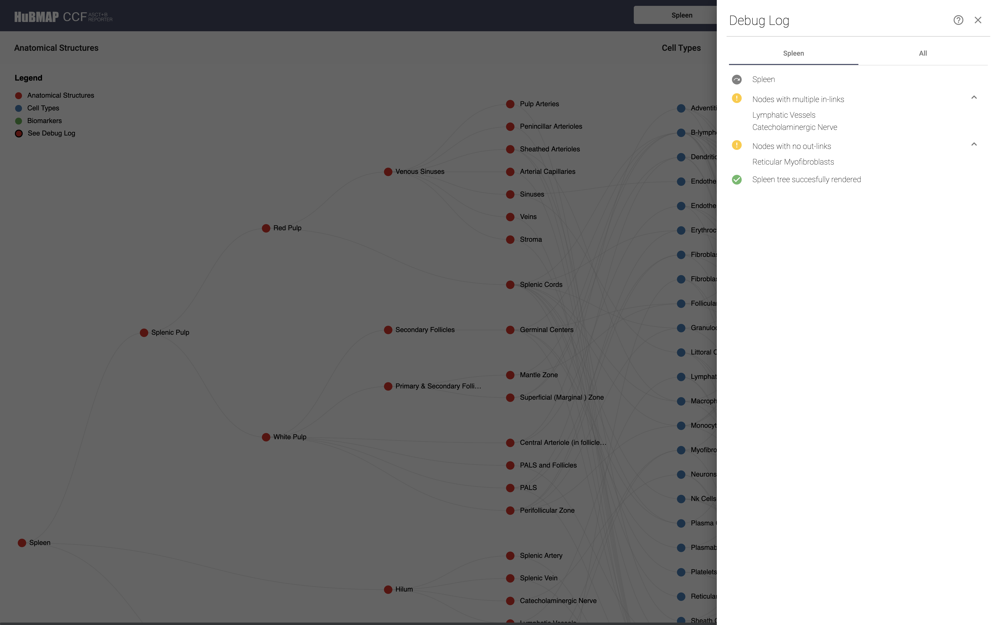

# HuBMAP CCF ASCT+B Reporter

The [CCF ASCT Reporter](https://hubmapconsortium.github.io/ccf-asct-reporter/) is a basic visualization tool for displaying the [flattened ASCT tables](https://docs.google.com/spreadsheets/u/1/d/1F7D0y7pNPVIR3W4LjjtIMGg7rKTOxwyjVKzS-iiffz4/edit#gid=2034682742) built using Angular 10.

[](https://github.com/hubmapconsortium/ccf-asct-reporter)
[](https://github.com/hubmapconsortium/ccf-asct-reporter/blob/master/LICENSE) 


## Overview

The [CCF ASCT+B Reporter](https://hubmapconsortium.github.io/ccf-asct-reporter/) includes a partonomy tree that presents relationships between various anatomical structures and substructures, that is combined with their respective cell types and biomarkers via a bimodal network. The reporter also presents an indented list tree for a more traditional look. Along with visualizing, the reporter has a report generator that enlists various meta data for the visualized ASCT table, which is download-able. There is also an in-house debug logger that lists any issues related to the data provided in the table. The reporter is also accompanied by a backend server, ASCT+B Data Miner.

## Installation

```shell
$ git clone https://github.com/hubmapconsortium/ccf-asct-reporter
$ cd ccf-asct-reporter

# Reporter
$ npm install
$ ng serve

# Miner
$ cd data-miner
$ npm install
$ npm start
```

## Deployment


```shell
$ git clone https://github.com/hubmapconsortium/ccf-asct-reporter
$ cd ccf-asct-reporter

# Reporter
$ npm run build
$ npm run deploy

# Miner
$ git subtree push --prefix data-miner miner master
```

## Details

### Currently supported ASCT Tables

Below are a list of ASCT+B tables supported by the Reporter,

- [Bone Marrow & Blood](https://docs.google.com/spreadsheets/d/1F7D0y7pNPVIR3W4LjjtIMGg7rKTOxwyjVKzS-iiffz4/edit#gid=1852470103)
- [Brain](https://docs.google.com/spreadsheets/d/1F7D0y7pNPVIR3W4LjjtIMGg7rKTOxwyjVKzS-iiffz4/edit#gid=345174398)
- [Heart](https://docs.google.com/spreadsheets/d/1F7D0y7pNPVIR3W4LjjtIMGg7rKTOxwyjVKzS-iiffz4/edit#gid=1240281363)
- [Intestine, Large](https://docs.google.com/spreadsheets/d/1F7D0y7pNPVIR3W4LjjtIMGg7rKTOxwyjVKzS-iiffz4/edit#gid=1687995716)
- [Kidney](https://docs.google.com/spreadsheets/d/1F7D0y7pNPVIR3W4LjjtIMGg7rKTOxwyjVKzS-iiffz4/edit#gid=1760639962)
- [Lung](https://docs.google.com/spreadsheets/d/1F7D0y7pNPVIR3W4LjjtIMGg7rKTOxwyjVKzS-iiffz4/edit#gid=925712902)
- [Lymph Nodes](https://docs.google.com/spreadsheets/d/1F7D0y7pNPVIR3W4LjjtIMGg7rKTOxwyjVKzS-iiffz4/edit#gid=272157091)
- [Skin](https://docs.google.com/spreadsheets/d/1F7D0y7pNPVIR3W4LjjtIMGg7rKTOxwyjVKzS-iiffz4/edit#gid=104836770)
- [Spleen](https://docs.google.com/spreadsheets/d/1F7D0y7pNPVIR3W4LjjtIMGg7rKTOxwyjVKzS-iiffz4/edit#gid=22580074)
- [Thymus](https://docs.google.com/spreadsheets/d/1F7D0y7pNPVIR3W4LjjtIMGg7rKTOxwyjVKzS-iiffz4/edit#gid=314238819)
- [Vasculature](https://docs.google.com/spreadsheets/d/1F7D0y7pNPVIR3W4LjjtIMGg7rKTOxwyjVKzS-iiffz4/edit#gid=1896956438)

### Features

- Visualization
- Compare
- Playground
- Indented List
- Report Generator
- Indented List
- Search
- Export 
- Visualization Functions
- Visualization Controls

### Documentation

Click [here](https://ccf-asct-reporter.netlify.app/docs) to view the documentation.

### Data Miner

The reporter is also accompanied by a backend server ASCT+B Data Miner. In the event of Google Sheets blocking requests by the Reporter or any error, the Reporter fetches the data from the Data Miner which runs a simple Node script to fetch the data from Google Sheets. By supplying the SheetId and GID to the Data Miner, the data from the flattened tables can be retrieved. If for some reason the Data Miner also fails to retrieve the data, the Reporter falls to its system cache, which contains a snapshot of the flattened tables. 

The Miner can also be used as a stand-alone tool to retrieve the data from the flattened Google sheets. Below is the API that you'll have to use,

```
https://asctb-data-miner.herokuapp.com/v2/<sheetID>/<gid>
```

This will either return the data, or will return a `500` HTTP code.

#### Deploying 

Since the ASCT+B Data Miner is a dynamic script, Heroku has been used to deploy the server. Heroky is free to use for this usage. Deploying on Heroku requires the `data-miner` folder to have an additional git remote. To deploy the latest changes to the Heroku cloud,

```shell
$ git add data-miner
$ git commit -m <commit_message>
$ git subtree push --prefix data-miner miner master
```

## Snippets





## Contributing

If you'd like to contribute, follow the steps below,
```shell
$ git clone https://github.com/hubmapconsortium/ccf-asct-reporter
$ cd ccf-asct-reporter
$ git checkout -b <new_branch_name>
```

Commit the changes to the new feature branch and make a pull request!

## License
[MIT](https://choosealicense.com/licenses/mit/)
